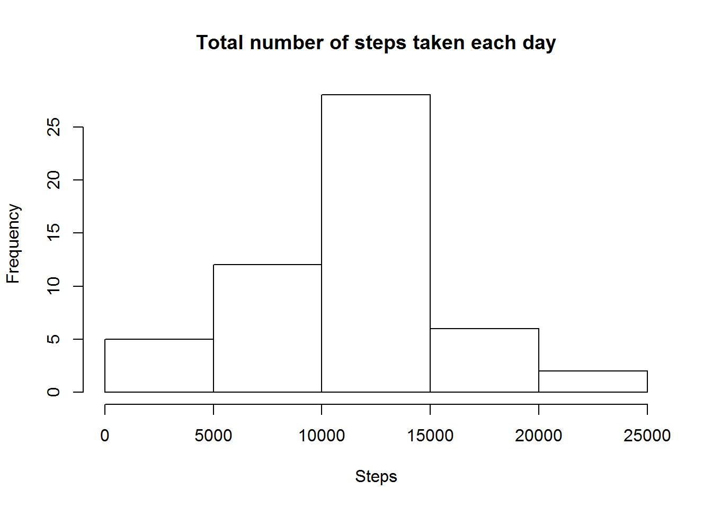
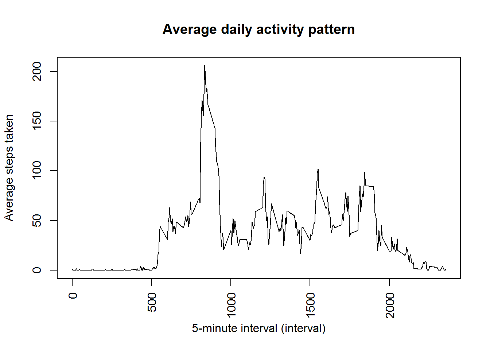
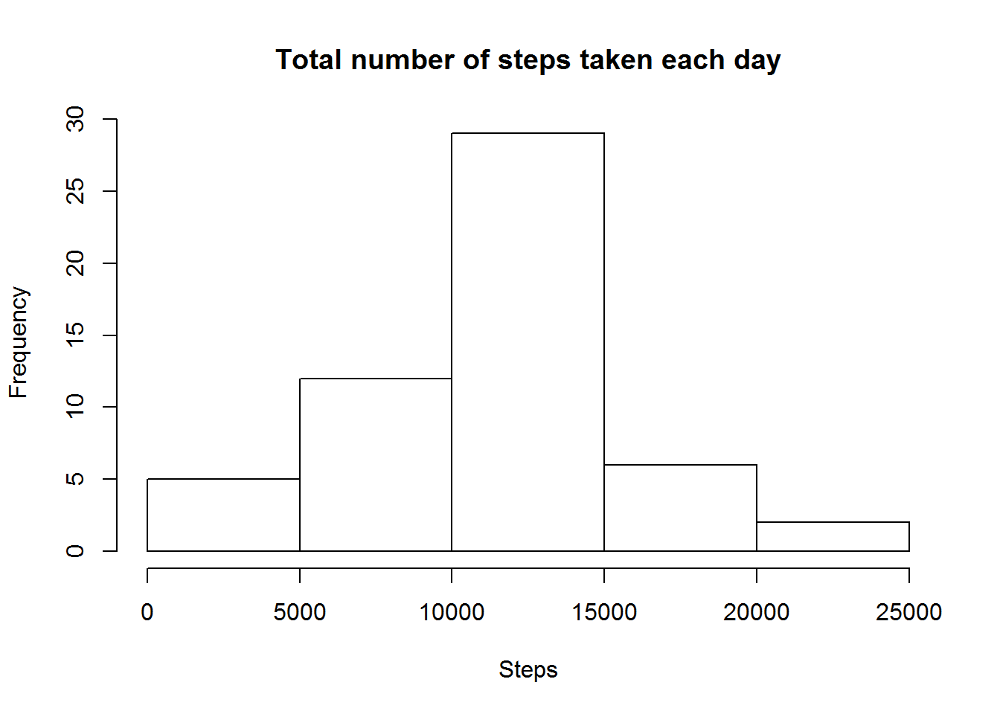
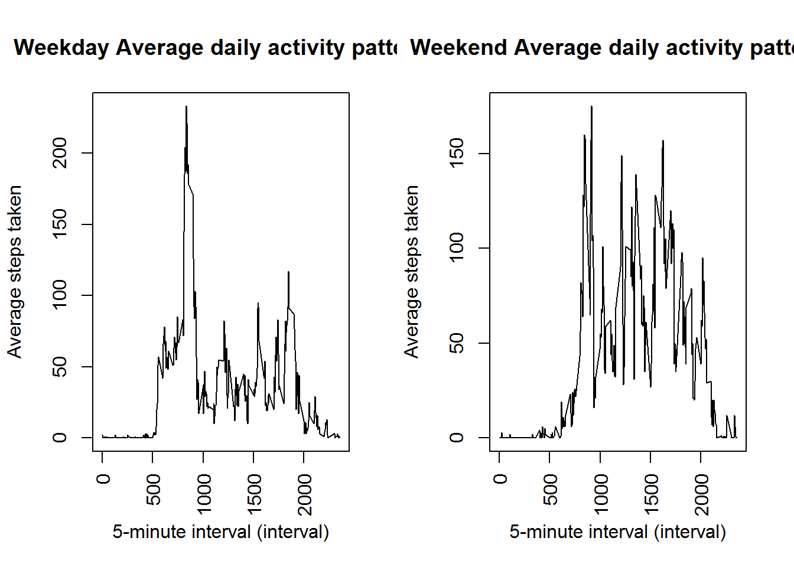

##Loading and processing the data
###1.Load the data

```r
activity<-read.csv("activity.csv")
```

###2.Process/transform the data (if necessary) into a format suitable for your analysis

```r
q1 <- sqldf("SELECT date, SUM(steps) AS steps FROM activity WHERE NOT steps IS NULL GROUP BY date")
```

##What is the mean total number of steps taken per day?
###1.Make a histogram of the total number of steps taken each day

```r
par(mfrow=c(1,1))
hist(q1$steps,main="Total number of steps taken each day",xlab="Steps")
```



###2.Calculate and report the mean and median total number of steps taken per day

```r
q2a <- mean(q1$steps)
q2a
```

```
## [1] 10766.19
```

```r
q2b <- median(q1$steps)
q2b
```

```
## [1] 10765
```

##What is the average daily activity pattern?
###1.Make a time series plot (i.e. type = "l") of the 5-minute interval (x-axis) and the average number of steps taken, averaged across all days (y-axis)

```r
q3 <- sqldf("SELECT interval, AVG(steps) AS steps FROM activity WHERE NOT steps IS NULL GROUP BY interval")
plot(q3$interval,q3$steps,type="l",xaxt="n",ylab="Average steps taken",xlab="5-minute interval (interval)")
title(main="Average daily activity pattern")
axis(1, at = seq(0, 2355, by = 500), las=2)
```



###2.Which 5-minute interval, on average across all the days in the dataset, contains the maximum number of steps?

```r
q4 <- max(q3$steps)
q4
```

```
## [1] 206
```

##Imputing missing values
###1.Calculate and report the total number of missing values in the dataset (i.e. the total number of rows with NAs)

```r
q5 <- sqldf("SELECT COUNT(*) AS records FROM activity WHERE steps IS NULL")
q5
```

```
##   records
## 1    2304
```

###2.Devise a strategy for filling in all of the missing values in the dataset. The strategy does not need to be sophisticated. For example, you could use the mean/median for that day, or the mean for that 5-minute interval, etc.

The strategy inplace is to calcualte the mean for each interval and then use this output for each interval for the missing values

```r
q6 <- sqldf("SELECT interval, AVG(steps) AS steps FROM activity WHERE NOT steps IS NULL GROUP BY interval")
q6
```

```
##     interval steps
## 1          0     1
## 2          5     0
## 3         10     0
## 4         15     0
## 5         20     0
## 6         25     2
## 7         30     0
## 8         35     0
## 9         40     0
## 10        45     1
## 11        50     0
## 12        55     0
## 13       100     0
## 14       105     0
## 15       110     0
## 16       115     0
## 17       120     0
## 18       125     1
## 19       130     1
## 20       135     0
## 21       140     0
## 22       145     0
## 23       150     0
## 24       155     0
## 25       200     0
## 26       205     0
## 27       210     1
## 28       215     0
## 29       220     0
## 30       225     0
## 31       230     0
## 32       235     0
## 33       240     0
## 34       245     0
## 35       250     1
## 36       255     0
## 37       300     0
## 38       305     0
## 39       310     0
## 40       315     0
## 41       320     0
## 42       325     0
## 43       330     1
## 44       335     0
## 45       340     0
## 46       345     0
## 47       350     0
## 48       355     0
## 49       400     1
## 50       405     0
## 51       410     2
## 52       415     0
## 53       420     0
## 54       425     0
## 55       430     4
## 56       435     0
## 57       440     3
## 58       445     0
## 59       450     3
## 60       455     1
## 61       500     0
## 62       505     1
## 63       510     3
## 64       515     2
## 65       520     3
## 66       525     2
## 67       530     2
## 68       535     6
## 69       540    16
## 70       545    18
## 71       550    39
## 72       555    44
## 73       600    31
## 74       605    49
## 75       610    53
## 76       615    63
## 77       620    49
## 78       625    47
## 79       630    52
## 80       635    39
## 81       640    44
## 82       645    44
## 83       650    37
## 84       655    49
## 85       700    43
## 86       705    44
## 87       710    50
## 88       715    54
## 89       720    49
## 90       725    50
## 91       730    55
## 92       735    44
## 93       740    52
## 94       745    69
## 95       750    57
## 96       755    56
## 97       800    73
## 98       805    68
## 99       810   129
## 100      815   157
## 101      820   171
## 102      825   155
## 103      830   177
## 104      835   206
## 105      840   195
## 106      845   179
## 107      850   183
## 108      855   167
## 109      900   143
## 110      905   124
## 111      910   109
## 112      915   108
## 113      920   103
## 114      925    95
## 115      930    66
## 116      935    45
## 117      940    24
## 118      945    38
## 119      950    34
## 120      955    21
## 121     1000    40
## 122     1005    26
## 123     1010    42
## 124     1015    52
## 125     1020    38
## 126     1025    50
## 127     1030    44
## 128     1035    37
## 129     1040    34
## 130     1045    28
## 131     1050    25
## 132     1055    31
## 133     1100    31
## 134     1105    29
## 135     1110    21
## 136     1115    25
## 137     1120    28
## 138     1125    26
## 139     1130    33
## 140     1135    49
## 141     1140    42
## 142     1145    44
## 143     1150    46
## 144     1155    59
## 145     1200    63
## 146     1205    87
## 147     1210    94
## 148     1215    92
## 149     1220    63
## 150     1225    50
## 151     1230    54
## 152     1235    32
## 153     1240    26
## 154     1245    37
## 155     1250    45
## 156     1255    67
## 157     1300    42
## 158     1305    39
## 159     1310    43
## 160     1315    40
## 161     1320    46
## 162     1325    56
## 163     1330    42
## 164     1335    25
## 165     1340    39
## 166     1345    53
## 167     1350    47
## 168     1355    60
## 169     1400    55
## 170     1405    51
## 171     1410    43
## 172     1415    48
## 173     1420    35
## 174     1425    37
## 175     1430    41
## 176     1435    27
## 177     1440    17
## 178     1445    26
## 179     1450    43
## 180     1455    43
## 181     1500    30
## 182     1505    36
## 183     1510    35
## 184     1515    38
## 185     1520    45
## 186     1525    47
## 187     1530    48
## 188     1535    65
## 189     1540    82
## 190     1545    98
## 191     1550   102
## 192     1555    83
## 193     1600    62
## 194     1605    64
## 195     1610    74
## 196     1615    63
## 197     1620    56
## 198     1625    59
## 199     1630    43
## 200     1635    38
## 201     1640    44
## 202     1645    45
## 203     1650    46
## 204     1655    43
## 205     1700    46
## 206     1705    56
## 207     1710    50
## 208     1715    61
## 209     1720    72
## 210     1725    78
## 211     1730    68
## 212     1735    59
## 213     1740    75
## 214     1745    56
## 215     1750    34
## 216     1755    37
## 217     1800    40
## 218     1805    58
## 219     1810    74
## 220     1815    85
## 221     1820    59
## 222     1825    67
## 223     1830    77
## 224     1835    74
## 225     1840    85
## 226     1845    99
## 227     1850    86
## 228     1855    85
## 229     1900    84
## 230     1905    77
## 231     1910    58
## 232     1915    53
## 233     1920    36
## 234     1925    20
## 235     1930    27
## 236     1935    40
## 237     1940    30
## 238     1945    25
## 239     1950    45
## 240     1955    33
## 241     2000    19
## 242     2005    19
## 243     2010    19
## 244     2015    33
## 245     2020    26
## 246     2025    21
## 247     2030    27
## 248     2035    21
## 249     2040    19
## 250     2045    21
## 251     2050    32
## 252     2055    20
## 253     2100    15
## 254     2105    17
## 255     2110    23
## 256     2115    19
## 257     2120    12
## 258     2125     8
## 259     2130    14
## 260     2135    16
## 261     2140     8
## 262     2145     7
## 263     2150     8
## 264     2155     2
## 265     2200     1
## 266     2205     3
## 267     2210     4
## 268     2215     8
## 269     2220     7
## 270     2225     8
## 271     2230     9
## 272     2235     2
## 273     2240     0
## 274     2245     0
## 275     2250     1
## 276     2255     4
## 277     2300     3
## 278     2305     2
## 279     2310     0
## 280     2315     0
## 281     2320     0
## 282     2325     1
## 283     2330     2
## 284     2335     4
## 285     2340     3
## 286     2345     0
## 287     2350     0
## 288     2355     1
```

###3.Create a new dataset that is equal to the original dataset but with the missing data filled in.

```r
q7 <- activity

for (n in 1:288)
{
q7$steps[n] <- q6$steps[n]
}
```

###4.Make a histogram of the total number of steps taken each day and Calculate and report the mean and median total number of steps taken per day. Do these values differ from the estimates from the first part of the assignment? What is the impact of imputing missing data on the estimates of the total daily number of steps?

```r
q8 <- sqldf("SELECT date, SUM(steps) AS steps FROM q7 WHERE NOT steps IS NULL GROUP BY date")
hist(q8$steps,main="Total number of steps taken each day",xlab="Steps")
```



```r
q9a <- mean(q8$steps)
q9a
```

```
## [1] 10763.87
```

```r
q10b <- median(q8$steps)
q10b
```

```
## [1] 10703
```

##Are there differences in activity patterns between weekdays and weekends?
###1.Create a new factor variable in the dataset with two levels - "weekday" and "weekend" indicating whether a given date is a weekday or weekend day.

```r
q11 <- sqldf("SELECT steps, date, strftime('%w', date) AS weekday_num, CASE WHEN strftime('%w', date) IN('1','2','3','4','5') THEN 'Weekday' ELSE 'Weekend' END AS weekday, interval FROM q7")
```

###2.Make a panel plot containing a time series plot (i.e. type = "l") of the 5-minute interval (x-axis) and the average number of steps taken, averaged across all weekday days or weekend days (y-axis). See the README file in the GitHub repository to see an example of what this plot should look like using simulated data.

```r
q12 <- sqldf("SELECT interval, AVG(steps) AS steps FROM q11 WHERE weekday = 'Weekday' GROUP BY interval")
q13 <- sqldf("SELECT interval, AVG(steps) AS steps FROM q11 WHERE weekday = 'Weekend' GROUP BY interval")

par(mfrow=c(1,2))

plot(q12$interval,q12$steps,type="l",xaxt="n",ylab="Average steps taken",xlab="5-minute interval (interval)")
title(main="Weekday Average daily activity pattern")
axis(1, at = seq(0, 2355, by = 500), las=2)

plot(q13$interval,q13$steps,type="l",xaxt="n",ylab="Average steps taken",xlab="5-minute interval (interval)")
title(main="Weekend Average daily activity pattern")
axis(1, at = seq(0, 2355, by = 500), las=2)
```




